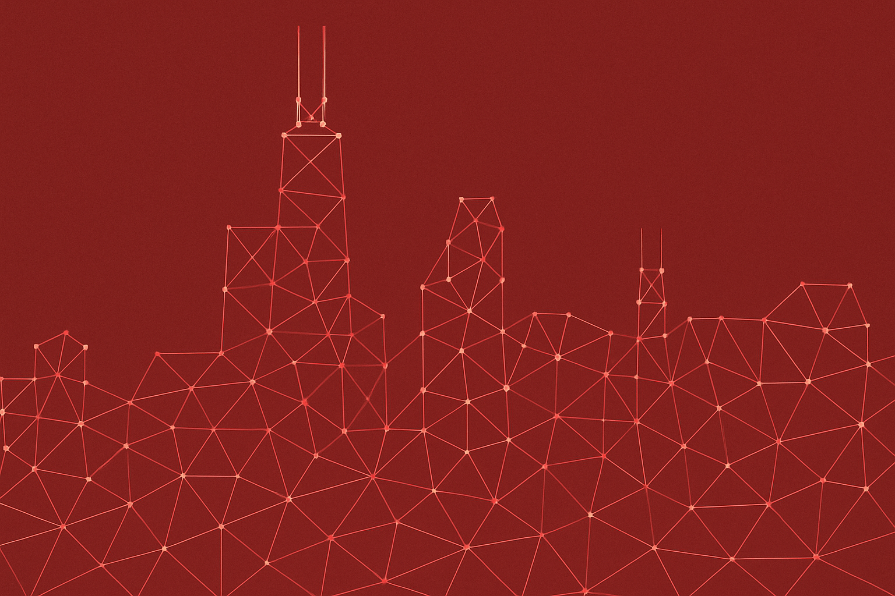

# When materials break the rules

[](https://github.com/bylehn/pme-symposium-2025/blob/main/slides-export.pdf) [](https://bylehn.github.io/pme-symposium-2025/) 

This presentation is powered by [Slidev](https://github.com/slidevjs/slidev) with [slidev-theme-academic](https://github.com/alexanderdavide/slidev-theme-academic).



To run the slide show locally:

- [install node.js](https://george-gca.github.io/blog/2023/slidev_for_non_web_devs/)
- `npm install`
- `npm run dev`
- visit http://localhost:3030

To check for dependencies that need to be updated, run:

```bash
npm outdated
```

which will output something like this:

```
Package      Current   Wanted  Latest  Location                  Depended by
@slidev/cli  0.43.11  0.43.15  0.46.1  node_modules/@slidev/cli  xxxxxxxx
```

To updated installed dependencies, simply run:

```bash
npm update
```

Keep in mind that npm update will never update to a major breaking-changes version, only to a minor one. What this means is, it will use the Wanted version in the table above instead of the Latest version. To obtain the Latest version, call the install command with @latest appended to the package name. For example, to update @slidev/cli to the latest version, run:

```bash
npm install @slidev/cli@latest
```